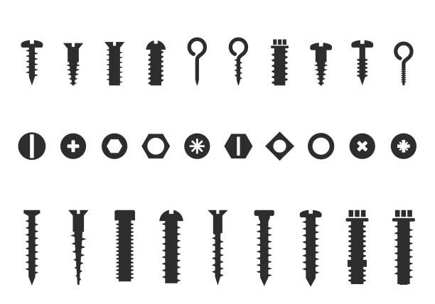

**Chào bạn! Hãy tưởng tượng thế giới mạng là một tòa nhà chung cư lớn. Chúng ta đã biết hai cách giao tiếp:**

**Unicast (Một-một): Bạn gõ cửa phòng 101 và chỉ nói chuyện với người trong phòng đó. Giống như TCP và UDP cơ bản.**

**Broadcast (Một-tất cả): Bạn đứng ở hành lang và hét lên: "CHÁY NHÀ!". Tất cả mọi người trong tòa nhà, dù muốn hay không, đều nghe thấy. Điều này rất ồn ào và phiền phức.**

**Nhưng nếu bạn muốn thông báo cho "Câu lạc bộ những người yêu mèo" trong tòa nhà về buổi họp mặt tối nay thì sao? Hét lên thì làm phiền người khác, còn gõ cửa từng phòng thì quá mất công.**

**Đây là lúc Multicast tỏa sáng!**

## Multicast Giống Như Một Kênh Radio Nội Bộ


**Multicast hoạt động giống như bạn tạo ra một kênh radio riêng cho "Câu lạc bộ yêu mèo" ở tần số 239.0.0.1.**

**Bạn (Người gửi): Bạn cầm micro lên và bắt đầu nói vào kênh 239.0.0.1: "Tối nay 8 giờ họp ở phòng sinh hoạt chung nhé!" Bạn chỉ cần nói một lần duy nhất.**

**Thành viên CLB (Người nhận): Những ai quan tâm đến mèo sẽ chủ động vặn radio của họ sang đúng kênh 239.0.0.1 để lắng nghe.**

**Những người khác: Những người không quan tâm sẽ không dò kênh này, và họ sẽ không bị làm phiền.**

**Tóm lại: Multicast là một phương pháp gửi một gói tin duy nhất từ một người gửi đến một nhóm người nhận đã đăng ký "lắng nghe". Nó hiệu quả hơn Broadcast (vì không làm phiền tất cả mọi người) và hiệu quả hơn Unicast (vì không phải gửi nhiều bản sao của cùng một gói tin).**

## Các "Linh Kiện" Chính Của Multicast



**Để kênh radio này hoạt động, chúng ta cần một vài thứ:**

### 1. Địa Chỉ Multicast (Các kênh Radio)


**Trong thế giới IP, các địa chỉ từ 224.0.0.0 đến 239.255.255.255 được dành riêng cho multicast. Mỗi địa chỉ này được gọi là một multicast group, tương ứng với một "kênh radio".**

**Ví dụ: Kênh 224.0.0.2 có thể dùng cho các router nói chuyện với nhau, kênh 239.1.2.3 có thể được ứng dụng của bạn dùng để gửi dữ liệu video.**

### 2. Giao Thức IGMP (Cái nút "Dò Kênh")

**IGMP (Internet Group Management Protocol) là cách mà máy của người nhận (cái radio) thông báo cho router mạng (người quản lý tòa nhà) rằng: "Này, tôi muốn nghe kênh 239.0.0.1 nhé. Nếu có tin gì ở kênh đó thì chuyển cho tôi."**

**Khi người dùng không muốn nghe nữa (tắt ứng dụng), máy của họ sẽ dùng IGMP để báo: "Tôi không nghe kênh 239.0.0.1 nữa đâu, đừng gửi cho tôi."**

**Router mạng sẽ ghi nhớ xem ở nhánh mạng của mình có ai đang muốn nghe kênh nào, và chỉ chuyển tiếp dữ liệu multicast đến những nhánh có người đăng ký.**

## Ai Sử Dụng Kênh Radio Multicast Này?


**Multicast cực kỳ hữu ích trong các ứng dụng cần gửi cùng một dữ liệu đến nhiều người nhận cùng lúc.**

### Truyền hình IPTV:


**Đây là ứng dụng phổ biến nhất. Thay vì nhà cung cấp phải tạo một luồng video riêng cho mỗi hộ gia đình đang xem VTV3 (Unicast), họ chỉ cần phát luồng video VTV3 đó vào một địa chỉ multicast.**

**Hàng ngàn hộ gia đình chỉ cần "dò" đúng kênh multicast đó để xem. Điều này tiết kiệm băng thông một cách khổng lồ!**

### Cập nhật thông tin thị trường chứng khoán:


**Dữ liệu giá cổ phiếu thay đổi liên tục và cần được gửi đến hàng ngàn nhà đầu tư ngay lập tức. Multicast là giải pháp hoàn hảo để đẩy những cập nhật này đi một cách nhanh chóng và đồng bộ.**

### Chơi game online:


**Trong một số game, dữ liệu về trạng thái của môi trường game (ví dụ: thời tiết thay đổi, một sự kiện trong game xảy ra) có thể được gửi qua multicast đến tất cả người chơi trong cùng một khu vực.**

### Khám phá dịch vụ (Service Discovery):


**Các thiết bị trong mạng cục bộ có thể gửi một gói tin multicast để hỏi: "Có máy in nào ở đây không?" và các máy in sẽ lắng nghe trên kênh đó để trả lời.**

## Ví Dụ Code: Tạo Một "Kênh Chat" Nội Bộ Bằng Multicast


**Hãy xem cách tạo một "kênh radio" đơn giản trong Java. Một người sẽ nói (gửi), và nhiều người khác có thể nghe (nhận).**

### 1. MulticastSender.java (Người nói vào radio)
Java
```
import java.net.DatagramPacket;
import java.net.DatagramSocket;
import java.net.InetAddress;

public class MulticastSender {
    public static void main(String[] args) throws Exception {
        // Địa chỉ kênh radio mà chúng ta sẽ phát
        InetAddress group = InetAddress.getByName("239.0.0.1");
        int port = 4446;

        // Tạo một socket để gửi đi
        DatagramSocket socket = new DatagramSocket();

        String msg = "Xin chào các thành viên CLB yêu mèo!";
        byte[] buffer = msg.getBytes();

        // Đóng gói tin nhắn vào một DatagramPacket gửi đến địa chỉ group và cổng đã định
        DatagramPacket packet = new DatagramPacket(buffer, buffer.length, group, port);

        // Gửi đi! Chỉ cần gửi 1 lần duy nhất
        socket.send(packet);
        System.out.println("Đã gửi tin nhắn: '" + msg + "'");
        
        socket.close();
    }
}
```
### 2. MulticastReceiver.java (Người nghe radio - có thể chạy nhiều receiver cùng lúc)
Java
```
import java.net.DatagramPacket;
import java.net.InetAddress;
import java.net.MulticastSocket;

public class MulticastReceiver {
    public static void main(String[] args) throws Exception {
        // Địa chỉ kênh radio mà chúng ta muốn nghe
        InetAddress group = InetAddress.getByName("239.0.0.1");
        int port = 4446;

        // Tạo một MulticastSocket để nghe trên cổng cụ thể
        MulticastSocket socket = new MulticastSocket(port);
        
        // Dùng IGMP để báo cho router rằng "Tôi muốn tham gia kênh này"
        socket.joinGroup(group);
        System.out.println("Đã dò kênh " + group.getHostAddress() + ". Đang chờ tin nhắn...");

        byte[] buffer = new byte[1024];
        DatagramPacket packet = new DatagramPacket(buffer, buffer.length);

        // Chờ nhận tin nhắn
        socket.receive(packet);
        String received = new String(packet.getData(), 0, packet.getLength());
        System.out.println("Nhận được tin: '" + received + "'");

        // Rời khỏi kênh
        socket.leaveGroup(group);
        socket.close();
    }
}
```
## Kết Luận

**Multicast là một kỹ thuật mạng cực kỳ thông minh và hiệu quả. Nó là sự cân bằng hoàn hảo giữa việc "nói riêng" cho từng người và "hét to" cho tất cả mọi người. Bằng cách tạo ra các nhóm đăng ký tự nguyện, multicast giúp tiết kiệm tài nguyên mạng và đảm bảo thông tin được gửi đến đúng đối tượng một cách nhanh chóng.**