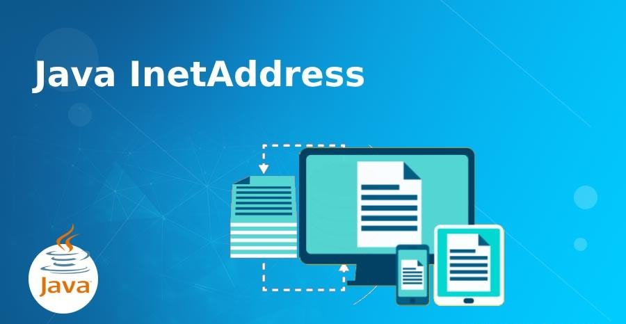

**Chào bạn! Trong thế giới thực, để liên lạc với ai đó, bạn có nhiều cấp độ thông tin khác nhau. Bạn có thể chỉ biết tọa độ GPS của nhà họ, hoặc bạn có một địa chỉ đầy đủ trên bì thư, hoặc bạn thực sự bắt đầu một cuộc trò chuyện với họ.**

**Trong Java, việc kết nối mạng cũng diễn ra theo các cấp độ tương tự. Hãy cùng khám phá ba công cụ chính: InetAddress, URL, và URLConnection.**

## 1. InetAddress: Tọa Độ GPS Của Máy Chủ


**Hãy bắt đầu ở mức cơ bản nhất. InetAddress giống như tọa độ GPS của một máy chủ trên Internet.**

**Nó là gì? Nó đại diện cho một địa chỉ IP (ví dụ: 142.250.204.78). Đây là thông tin cốt lõi nhất để xác định vị trí của một máy tính trên mạng.**

**Công dụng: Nhiệm vụ chính của nó là "tra bản đồ", tức là chuyển đổi một tên miền (google.com) thành tọa độ GPS của nó (địa chỉ IP).**

**Hạn chế: Giống như tọa độ GPS, nó chỉ cho bạn biết vị trí của tòa nhà, chứ không cho bạn biết phải vào cửa nào, hay bạn muốn lấy thứ gì từ bên trong.**

**Nó là nền tảng, là thông tin vị trí thô.**

Java
```
import java.net.InetAddress;
import java.net.UnknownHostException;

public class AddressFinder {
    public static void main(String[] args) {
        try {
            // Dùng InetAddress để tìm "tọa độ" của Google
            InetAddress googleAddress = InetAddress.getByName("google.com");
            System.out.println("Tọa độ GPS (IP) của Google: " + googleAddress.getHostAddress());
        } catch (UnknownHostException e) {
            System.err.println("Không tìm thấy địa chỉ này trên bản đồ!");
        }
    }
}
```
## 2. URL: Bì Thư Với Địa Chỉ Đầy Đủ


**Biết tọa độ là tốt, nhưng để gửi thư, bạn cần nhiều hơn thế. Bạn cần một URL, thứ giống như một bì thư được ghi địa chỉ đầy đủ và chi tiết.**

**Nó là gì? URL (Uniform Resource Locator) là một chuỗi địa chỉ hoàn chỉnh, ví dụ:
`https://www.google.com/search?q=java`.**

**Công dụng: Nó chứa tất cả thông tin cần thiết để xác định một tài nguyên cụ thể trên mạng:**

**Giao thức (`https://`): Dùng dịch vụ bưu chính nào? (Chuyển phát nhanh bảo mật).**

**Tên miền (`www.google.com`): Tòa nhà nào?**

**Đường dẫn (`/search`): Đến phòng ban nào trong tòa nhà?**

**Tham số (`?q=java`): Yêu cầu cụ thể của bạn là gì? (Tìm tài liệu về "java").**

**URL là một con trỏ tĩnh, nó chỉ là cái địa chỉ, là thông tin trên bì thư. Nó chưa phải là hành động gửi thư.**


Java
```
import java.net.MalformedURLException;
import java.net.URL;

public class URLExplorer {
    public static void main(String[] args) {
        try {
            // Tạo một "bì thư" với địa chỉ đầy đủ
            URL myUrl = new URL("https://www.example.com/some/page?user=test");
            
            System.out.println("Dịch vụ bưu chính (Protocol): " + myUrl.getProtocol());
            System.out.println("Tòa nhà (Host): " + myUrl.getHost());
            System.out.println("Phòng ban (Path): " + myUrl.getPath());
            System.out.println("Yêu cầu cụ thể (Query): " + myUrl.getQuery());
        } catch (MalformedURLException e) {
            System.err.println("Địa chỉ trên bì thư không hợp lệ!");
        }
    }
}
```

## 3. URLConnection: Người Đưa Thư

**Bạn đã có địa chỉ trên bì thư (URL). Bây giờ, bạn cần một người thực sự đi đến đó, gõ cửa, và bắt đầu giao tiếp. URLConnection chính là người đưa thư đó.**

**Nó là gì? URLConnection là một kết nối đang hoạt động đến tài nguyên được chỉ định bởi một URL. Nó không còn là thông tin tĩnh nữa, mà là một kênh giao tiếp mở.**

**Công dụng: Sau khi bạn đưa "bì thư" (URL) cho "người đưa thư" (URLConnection), anh ta sẽ:**

**Đi đến địa chỉ và gõ cửa (.connect()): Thiết lập kết nối mạng thực sự.**

**Nhận phản hồi (.getInputStream()): Mở một "đường ống" để bạn có thể nhận dữ liệu (nội dung trang web, hình ảnh...).**

**Xem thông tin (.getHeaderFields()): Đọc các thông tin meta về phản hồi, giống như xem các con dấu trên bì thư trả lời.**

**Nó là cây cầu nối giữa chương trình của bạn và tài nguyên ở xa.**

Java
```
import java.io.BufferedReader;
import java.io.InputStreamReader;
import java.net.URL;
import java.net.URLConnection;

public class ConnectionManager {
    public static void main(String[] args) {
        try {
            // 1. Tạo "bì thư"
            URL siteURL = new URL("https://www.example.com");
            
            // 2. Đưa bì thư cho "người đưa thư"
            URLConnection connection = siteURL.openConnection();
            
            // 3. Yêu cầu người đưa thư bắt đầu làm việc và lấy nội dung về
            try (BufferedReader reader = new BufferedReader(new InputStreamReader(connection.getInputStream()))) {
                System.out.println("Đã kết nối thành công!");
                System.out.println("Đang đọc nội dung từ example.com...");
                
                String line;
                // Chỉ đọc 5 dòng đầu tiên cho ngắn gọn
                for (int i = 0; i < 5 && (line = reader.readLine()) != null; i++) {
                    System.out.println(line);
                }
            }
        } catch (Exception e) {
            System.err.println("Gặp lỗi khi kết nối hoặc đọc dữ liệu: " + e.getMessage());
        }
    }
}
```

## Tổng Kết

**Hãy nhớ mối quan hệ xây dựng này:**

**InetAddress là khái niệm cơ bản nhất, chỉ là vị trí (IP).**

**URL xây dựng trên đó, thêm nhiều ngữ cảnh hơn để tạo ra một địa chỉ tài nguyên hoàn chỉnh.**

**URLConnection là bước cuối cùng, sử dụng URL để tạo ra một kết nối sống cho phép bạn thực sự trao đổi dữ liệu.**

**Hiểu rõ ba cấp độ này sẽ giúp bạn làm chủ mọi tác vụ mạng trong Java, từ việc đơn giản là kiểm tra một địa chỉ IP cho đến việc tải về toàn bộ nội dung của một trang web.**

