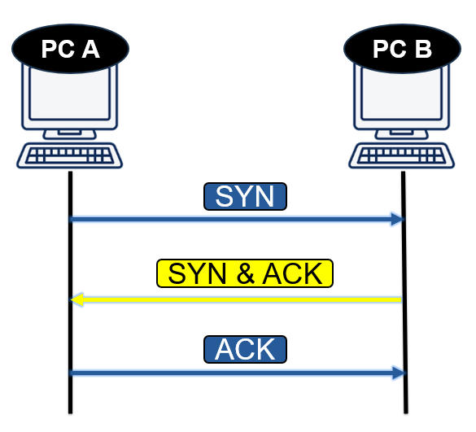

Bạn đã bao giờ tự hỏi làm thế nào mà một email quan trọng, một bức ảnh kỷ niệm, hay một tập tin công việc lại có thể đi từ máy tính này sang máy tính khác qua mạng Internet rộng lớn mà không bị mất mát hay sai sót một mẩu dữ liệu nào không? "Phép màu" đằng sau sự toàn vẹn đó phần lớn đến từ một giao thức nền tảng có tên là TCP, hay Transmission Control Protocol (Giao thức Điều khiển Truyền vận).

Hãy tưởng tượng bạn đang gửi một bộ lắp ráp mô hình quý giá qua đường bưu điện. Bạn sẽ không chỉ đơn giản là ném các mảnh ghép vào một chiếc hộp và hy vọng người nhận có thể tự mình sắp xếp chúng. Thay vào đó, bạn sẽ cẩn thận đánh số thứ tự từng mảnh, kiểm tra kỹ lưGiao thức TCP (Transmission Control Protocol) là một trong những giao thức cốt lõi của bộ giao thức Internet (IP), đóng vai trò thiết yếu trong việc đảm bảo truyền dữ liệu một cách đáng tin cậy và có trật tự giữa các ứng dụng trên mạng. Hãy cùng tìm hiểu sâu hơn về cách thức hoạt động và tầm quan trọng của TCP.

## TCP-Transnmission Control Protocol

Giao thức TCP được sử dụng ở tầng vận chuyển (OSI) đảm bảo cho dữ liệu gởi đi được tin cậy và xác thực giữa các nút mạng. Giao thức TCP phân chia dữ liệu thành các gói tin gọi là datagram. TCP gắn thêm phần header vào datagram. Phần header được mô tả trong hình vẽ bên dưới.

| **Trường** | **Mô tả** |
|-------------|------------|
| **Source Port** | Cổng gửi dữ liệu (ứng dụng gửi). |
| **Destination Port** | Cổng nhận dữ liệu (ứng dụng đích). |
| **Sequence Number** | Số thứ tự của byte đầu tiên trong gói tin hiện tại. |
| **Acknowledgement Number** | Số xác nhận – thông báo đã nhận đến byte nào. |
| **Data Offset** | Độ dài phần header (đơn vị 32 bit). |
| **Reserved** | Dự trữ cho tương lai, luôn bằng 0. |
| **Flags** | Các cờ điều khiển (SYN, ACK, FIN, RST, PSH, URG...). |
| **Window (Sliding Window)** | Kích thước cửa sổ – lượng dữ liệu có thể nhận tiếp. |
| **Checksum** | Kiểm tra lỗi của toàn bộ gói TCP. |
| **Urgent Pointer** | Chỉ vị trí dữ liệu khẩn cấp (nếu có). |
| **Options** | Tùy chọn mở rộng (ví dụ: MSS, Window Scale...). |
| **Padding** | Đệm bit 0 để header là bội số của 32 bit. |
| **Data** | Dữ liệu thực tế được truyền. |

---
## Cách Giao Thức TCP Hoạt Động

Tiếp Theo Chúng Ta Sẽ Nói Về Các Cơ Chế Trong TCP

### Bắt Tay 3 Bước

Điểm đặc trưng nhất của TCP chính là cơ chế thiết lập kết nối đáng tin cậy thông qua quy trình "bắt tay ba bước" (Three-Way Handshake). Quá trình này đảm bảo rằng cả hai thiết bị (máy gửi và máy nhận) đều sẵn sàng và đồng bộ trước khi bất kỳ dữ liệu thực tế nào được trao đổi.

Hãy hình dung quy trình này như một cuộc gọi điện thoại:

SYN (Synchronize): Máy gửi (Client) bắt đầu bằng cách gửi một gói tin đặc biệt gọi là SYN đến máy nhận (Server). Điều này giống như bạn nhấc máy và nói: "Alo, bạn có nghe rõ tôi không?"

SYN-ACK (Synchronize-Acknowledge): Nếu máy nhận sẵn sàng, nó sẽ gửi lại một gói tin SYN-ACK. Điều này có nghĩa là: "Tôi nghe rõ! Bạn có nghe rõ tôi không?"

ACK (Acknowledge): Cuối cùng, máy gửi ban đầu sẽ gửi lại một gói tin ACK để xác nhận. Giống như bạn trả lời: "Tôi cũng nghe rõ! Chúng ta có thể bắt đầu nói chuyện."

Sau khi ba bước này hoàn tất, một kết nối ổn định đã được thiết lập, và dữ liệu có thể bắt đầu được truyền đi.

### Truyền Dữ Liệu

Khi kết nối đã sẵn sàng, TCP không gửi toàn bộ dữ liệu (ví dụ: một file ảnh lớn) cùng một lúc. Thay vào đó, nó thực hiện một quy trình rất tỉ mỉ:

1. Chia nhỏ và Đánh số (Segmentation & Sequence Numbers)

Hành động: TCP chia dữ liệu lớn của bạn thành các phần nhỏ hơn, dễ quản lý hơn gọi là phân đoạn (segments). Quan trọng nhất, mỗi phân đoạn này được gán một số thứ tự (sequence number) duy nhất.

Tương tự như: Bạn viết câu chuyện của mình ra 10 tấm bưu thiếp và cẩn thận đánh số "Trang 1/10", "Trang 2/10",... ở góc mỗi tấm. Điều này đảm bảo người nhận có thể ghép chúng lại theo đúng thứ tự, ngay cả khi người đưa thư giao chúng một cách lộn xộn.

2. Gửi và Chờ Xác Nhận (Acknowledgement - ACK)

Hành động: Máy gửi sẽ gửi đi một hoặc một vài phân đoạn dữ liệu. Sau khi máy nhận nhận được các phân đoạn này một cách nguyên vẹn, nó sẽ gửi lại một gói tin xác nhận gọi là ACK, báo rằng: "Tôi đã nhận được dữ liệu đến số thứ tự X rồi, hãy gửi phần tiếp theo đi!"

Tương tự như: Sau khi gửi đi tấm bưu thiếp "Trang 1", bạn sẽ chờ bạn mình nhắn tin lại: "Đã nhận trang 1 nhé!". Khi nhận được tin nhắn đó, bạn mới yên tâm gửi tiếp "Trang 2".

3. Gửi lại Nếu Bị Thất Lạc (Retransmission)

Hành động: Điều gì xảy ra nếu một phân đoạn bị mất trên đường truyền, hoặc gói tin ACK bị thất lạc? Máy gửi sẽ đặt một bộ đếm thời gian. Nếu hết thời gian mà không nhận được ACK cho một phân đoạn nào đó, nó sẽ mặc định rằng phân đoạn đó đã bị mất và tự động gửi lại chính xác phân đoạn đó.

Tương tự như: Bạn gửi đi "Trang 3" và chờ mãi không thấy bạn mình xác nhận. Bạn sẽ nghĩ rằng tấm bưu thiếp đó đã bị thất lạc và lấy một tấm khác, viết lại nội dung "Trang 3" rồi gửi lại để đảm bảo câu chuyện không bị thiếu.

4. Kiểm tra Lỗi (Checksum)

Hành động: Mỗi phân đoạn TCP đều chứa một giá trị gọi là checksum. Đây là một con số được tính toán dựa trên nội dung của dữ liệu. Khi máy nhận nhận được phân đoạn, nó cũng tự tính toán checksum. Nếu con số này không khớp với checksum được gửi đến, máy nhận sẽ biết rằng dữ liệu đã bị lỗi trên đường truyền và sẽ hủy bỏ phân đoạn đó (và chờ máy gửi gửi lại).

Tương tự như: Bạn ghi số lượng từ trên mỗi tấm bưu thiếp. Người bạn của bạn khi nhận được sẽ đếm lại số từ. Nếu không khớp, họ biết rằng tấm bưu thiếp đã bị mờ hoặc rách và sẽ yêu cầu bạn gửi lại.

## Kiểm Soát Luồng và Tránh Tắc Nghẽn

TCP rất "thông minh" trong việc quản lý tốc độ truyền dữ liệu.

Kiểm soát luồng (Flow Control): Máy nhận có thể thông báo cho máy gửi về khả năng tiếp nhận dữ liệu của mình (gọi là "cửa sổ nhận"). Nếu máy nhận đang bận xử lý, nó có thể yêu cầu máy gửi giảm tốc độ lại để tránh bị quá tải.

Kiểm soát tắc nghẽn (Congestion Control): TCP có thể phát hiện các dấu hiệu tắc nghẽn trên mạng (ví dụ: các gói tin bắt đầu bị mất). Khi phát hiện tắc nghẽn, nó sẽ chủ động giảm tốc độ gửi để làm giảm áp lực cho mạng, giúp duy trì sự ổn định cho tất cả mọi người.

## Khi Nào Chúng Ta Sử Dụng TCP?

Vì sự đáng tin cậy là ưu tiên hàng đầu, TCP là lựa chọn lý tưởng cho các ứng dụng mà ở đó mỗi bit dữ liệu đều quan trọng. Ví dụ:

Duyệt web (HTTP/HTTPS): Để các trang web hiển thị chính xác.

Gửi/nhận Email (SMTP, POP3, IMAP): Để đảm bảo nội dung email không bị sai lệch.

Truyền file (FTP): Để chắc chắn rằng tập tin được tải xuống hoặc tải lên một cách toàn vẹn.

Kết nối đầu cuối an toàn (SSH): Để mọi lệnh bạn gõ đều được thực thi đúng.

## Kết Luận

TCP có thể không phải là giao thức nhanh nhất (vì các quy trình kiểm tra và xác nhận của nó), nhưng nó chắc chắn là một trong những giao thức đáng tin cậy nhất. Nó hoạt động như một người quản lý cần mẫn và cẩn thận ở hậu trường, đảm bảo rằng thế giới kỹ thuật số của chúng ta vận hành một cách trơn tru và chính xác. Lần tới khi bạn gửi một email hay tải một trang web, hãy nhớ đến quy trình "bắt tay" và kiểm tra tỉ mỉ mà TCP đang thực hiện để giúp bạn.