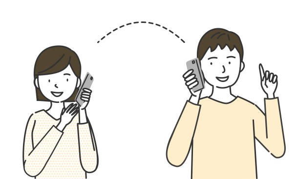

**Chào bạn! Trong thế giới mạng máy tính, có hai "anh em" giao hàng nổi tiếng mà bạn sẽ nghe đi nghe lại: TCP và UDP. Nếu ở bài trước, chúng ta đã gặp UDP, 'gã giao hàng siêu tốc' nhưng hay làm mất hàng, thì hôm nay chúng ta sẽ tìm hiểu người anh cẩn thận của nó: TCP (Transmission Control Protocol).**

**TCP chính là người nhân viên giao hàng cẩn thận, luôn gọi điện xác nhận, giao đúng thứ tự, và yêu cầu bạn ký nhận. Mọi thứ chậm hơn một chút, nhưng cực kỳ đáng tin cậy.** 


## TCP (Transmission Control Protocol) giống như một cuộc điện thoại

**Đây là một quy trình giao tiếp đầy đủ, có đầu có cuối và cực kỳ nghiêm túc.**

**- 1. Bấm số ("Bắt tay ba bước"): Bạn không thể nói chuyện ngay. Bạn phải:**

**Bạn: Bấm số và gọi ("A lô, tôi gọi đây!" - Gói SYN)**

**Người nhận: Nhấc máy ("Tôi nghe đây, tôi sẵn sàng!" - Gói SYN-ACK)**

**Bạn: Xác nhận ("Ok, tôi bắt đầu nói đây!" - Gói ACK) Chỉ sau khi "cuộc gọi" được kết nối, dữ liệu mới bắt đầu được gửi.**

**- 2. Trò chuyện (Truyền dữ liệu có thứ tự & Kiểm soát lỗi):**

**Đúng thứ tự: Khi bạn nói "Câu 1, Câu 2, Câu 3", người nghe sẽ nhận được đúng thứ tự đó. TCP đánh số các gói tin để đảm bảo điều này.**

**Có xác nhận: Sau khi bạn nói một đoạn, người nghe sẽ "ờ, ừm" (gửi ACK) để báo là đã nghe rõ.**

**Gửi lại nếu mất: Nếu người nghe không nghe rõ (gói tin bị mất), họ sẽ yêu cầu: "Bạn nói lại được không?". TCP sẽ tự động gửi lại gói tin bị thất lạc.**

**- 3. Chào tạm biệt (Đóng kết nối): Khi nói xong, cả hai cùng nói "Tạm biệt" rồi mới gác máy. Kết nối được đóng lại một cách lịch sự, đảm bảo không còn dữ liệu nào bị lỡ.**

**=> Đặc điểm của TCP: Cực kỳ tin cậy, đảm bảo dữ liệu đến nơi, đúng thứ tự, và không bị lỗi. Nhưng đổi lại, nó có nhiều thủ tục hơn và chậm hơn một chút.**

## Vậy, Khi Nào Cần Một Người Giao Hàng 'Chắc Cú'?
**Nếu UDP là người hùng của livestream và game, thì TCP là nền tảng của gần như mọi thứ còn lại trên Internet. Bạn không thể chấp nhận sự mất mát dữ liệu trong các tình huống sau:**

**- 1. Tải một Trang Web (HTTP/HTTPS):**

**Vấn đề: Bạn không thể chấp nhận một trang web bị mất một nửa file HTML hay một đoạn CSS. Nếu vậy, trang web sẽ bị vỡ hoàn toàn.**

**Giải pháp TCP: Đảm bảo mọi ký tự, mọi file ảnh, mọi file CSS đều được tải về đầy đủ và lắp ráp đúng thứ tự.**

**- 2. Gửi và Nhận Email (SMTP/IMAP):**

**Vấn đề: Một email bị mất vài chữ có thể thay đổi hoàn toàn ý nghĩa.**

**Giải pháp TCP: Đảm bảo nội dung email của bạn được gửi đi hoặc nhận về một cách nguyên vẹn 100%.**

**- 3. Tải File (FTP):**

**Vấn đề: Một file cài đặt phần mềm hay một file nén bị lỗi dù chỉ một bit cũng có thể trở nên vô dụng.**

**Giải pháp TCP: Đảm bảo file bạn tải về giống hệt 100% so với file gốc trên máy chủ.**

**Nguyên tắc vàng: Nếu dữ liệu của bạn không được phép mất mát hay sai thứ tự dù chỉ một chút, hãy dùng TCP.**


## Ví Dụ Code: Một Cuộc Trò Chuyện (Chat) Bằng TCP
**Hãy xem cách "thực hiện cuộc gọi" trong Java hoạt động như thế nào. Chúng ta sẽ có một Server (người nghe điện thoại) và một Client (người gọi đến).**

### TCPServer.java (Người nghe điện thoại)
Java
```
import java.io.BufferedReader;
import java.io.InputStreamReader;
import java.io.PrintWriter;
import java.net.ServerSocket;
import java.net.Socket;

public class TCPServer {
    public static void main(String[] args) throws Exception {
        System.out.println("Server đã sẵn sàng, đang chờ cuộc gọi...");
        
        // 1. Tạo một "tổng đài" (ServerSocket) chờ ở cổng 6789
        ServerSocket welcomeSocket = new ServerSocket(6789);

        while (true) {
            // 2. Chấp nhận một cuộc gọi đến (accept()). 
            // Chương trình sẽ dừng ở đây cho đến khi có Client gọi.
            Socket connectionSocket = welcomeSocket.accept();
            System.out.println("Client đã kết nối!");

            // 3. Tạo luồng để "nghe" từ Client
            BufferedReader inFromClient = new BufferedReader(new InputStreamReader(connectionSocket.getInputStream()));

            // 4. Tạo luồng để "nói" với Client
            PrintWriter outToClient = new PrintWriter(connectionSocket.getOutputStream(), true);

            // 5. Nghe Client nói
            String clientSentence = inFromClient.readLine();
            System.out.println("Client nói: " + clientSentence);

            // 6. Trả lời Client
            outToClient.println("Server đã nhận được tin nhắn của bạn!");
            
            // 7. Gác máy (đóng kết nối với client này)
            connectionSocket.close();
        }
    }
}
```
### TCPClient.java (Người gọi điện)
Java
```
import java.io.BufferedReader;
import java.io.InputStreamReader;
import java.io.PrintWriter;
import java.net.Socket;

public class TCPClient {
    public static void main(String[] args) throws Exception {
        // 1. Lấy "điện thoại" (Socket) và gọi đến "localhost" ở cổng 6789
        Socket clientSocket = new Socket("localhost", 6789);
        System.out.println("Đã kết nối tới Server.");

        // 2. Chuẩn bị để gõ tin nhắn (từ bàn phím)
        BufferedReader inFromUser = new BufferedReader(new InputStreamReader(System.in));

        // 3. Tạo luồng để "nói" với Server
        PrintWriter outToServer = new PrintWriter(clientSocket.getOutputStream(), true);

        // 4. Tạo luồng để "nghe" Server trả lời
        BufferedReader inFromServer = new BufferedReader(new InputStreamReader(clientSocket.getInputStream()));

        // 5. Gõ một câu
        System.out.print("Nhập tin nhắn để gửi: ");
        String sentence = inFromUser.readLine();
        
        // 6. Gửi câu đó cho Server
        outToServer.println(sentence);

        // 7. Nghe Server phản hồi
        String serverResponse = inFromServer.readLine();
        System.out.println("Server trả lời: " + serverResponse);

        // 8. Gác máy
        clientSocket.close();
    }
}
```
## Kết Luận

**TCP chính là nền tảng vững chắc cho phần lớn những gì chúng ta làm trên Internet hàng ngày. Nó có thể không nhanh bằng UDP, nhưng sự cẩn thận và đáng tin cậy của nó là không thể thay thế.**

**Giống như trong cuộc sống, đôi khi bạn cần một tấm bưu thiếp nhanh gọn (UDP), nhưng trong hầu hết các trường hợp quan trọng, bạn cần một cuộc gọi điện thoại nghiêm túc (TCP).**