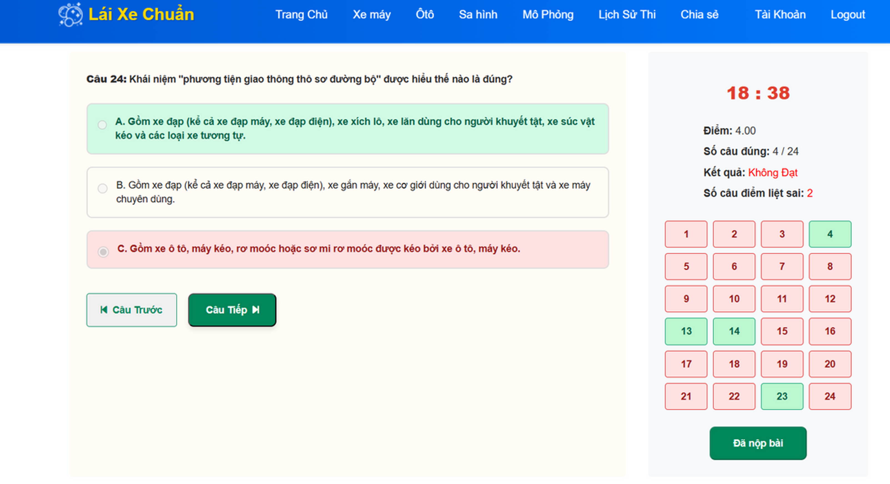

# Học Vấn

## Kỹ Sư Công Nghệ Phần Mềm 

### Đại Học Công Nghệ Tp Hồ Chí Minh(HUTECH) - Thủ Đức Campus | Tháng 8 Năm 2025 - Hiện tại
*[HUTECH](https://www.hutech.edu.vn/) là trường đại học tư thục đào tạo đa ngành tại Việt Nam. Năm 2024, HUTECH đạt chuẩn đánh giá quốc tế QS Stars 4 Sao chu kỳ 2 theo Bộ chuẩn mới QS Stars phiên bản 6.0 ban hành vào tháng 02/2024.*



**Xuyên suốt quá trình học tập tại giảng đường, tôi đã xây dựng được một nền tảng kiến thức tốt về các nguyên lý kỹ thuật phần mềm, được thể hiện qua kết quả học tập tốt ở các môn học chuyên ngành. Tôi không chỉ tập trung vào việc nắm vững lý thuyết ở trường, mà còn chủ động tìm cách áp dụng những kiến thức này vào các đồ án thực tế, coi đó là cầu nối quan trọng nhất để chuẩn bị cho các dự án trong môi trường làm việc chuyên nghiệp.**


***

# Các Dự Án Đã Tham Gia

## Quản Lý Rạp Chiếu Phim

### Học Phần Lập Trình Trên Môi Trường Window - Tháng 12 Năm 2025 - Tháng 1 Năm 2026

  
  
  
  
  
  


    Github Dự Án


**"Ứng dụng Quản lý Rạp Chiếu Phim" là một giải pháp phần mềm desktop được thiết kế để tối ưu hóa và đơn giản hóa quy trình vận hành tại các rạp chiếu phim. Với giao diện trực quan và các chức năng quản lý , ứng dụng giúp nhân viên dễ dàng thực hiện các nghiệp vụ hàng ngày, từ bán vé đến báo cáo doanh thu, góp phần nâng cao hiệu quả kinh doanh và trải nghiệm của khách hàng.**

**Trong vai trò là thành viên nhóm phát triển, tôi đã trực tiếp tham gia vào việc xây dựng các module chức năng của ứng dụng. Cụ thể, tôi chịu trách nhiệm thiết kế và lập trình giao diện người dùng cho các form quản lý lịch chiếu và bán vé, đồng thời xây dựng các logic xử lý nghiệp vụ liên quan. Ngoài ra, tôi cũng tham gia vào việc kết nối ứng dụng với cơ sở dữ liệu, đảm bảo dữ liệu được lưu trữ và truy xuất một cách chính xác và hiệu quả. Thông qua dự án này, tôi đã củng cố vững chắc kỹ năng lập trình C# trên nền tảng .NET WinForms, rèn luyện khả năng làm việc nhóm và hiểu sâu hơn về quy trình phát triển một ứng dụng desktop hoàn chỉnh.**

**Điểm học phần: 4.0/4.0**



## Hỗ Trợ Luyện Thi Bằng Lái Xe

### Học Phần Công Nghệ Phần Mềm - Tháng 5 Năm 2025 - Tháng 6 Năm 2025

  
  
  
  
  
  


    Github Dự Án


**"Ứng dụng Hỗ Trợ Luyện Thi Bằng Lái Xe" là một nền tảng học tập trực tuyến nhằm hỗ trợ học viên ôn luyện và chuẩn bị tốt nhất cho kỳ thi lý thuyết lái xe. Với giao diện thân thiện và tính năng đa dạng, ứng dụng giúp người học nắm vững kiến thức giao thông, làm quen với các câu hỏi thi thật và tự tin vượt qua kỳ thi ngay từ lần đầu tiên.**

**Trong vai trò là thành viên nhóm phát triển, tôi đã đóng góp vào dự án thông qua việc xây dựng và triển khai một số API phục vụ cho các chức năng chính của ứng dụng. Cụ thể, tôi đã phát triển các endpoint để xử lý dữ liệu ,tích hợp các tính năng backend cần thiết, kết nối với hệ thống cơ sơ dữ liệu. Ngoài ra, tôi cũng tham gia phát triển một số chức năng giao diện người dùng, đảm bảo sự tương tác mượt mà giữa front-end và back-end. Thông qua công việc này, tôi đã nâng cao kỹ năng lập trình, làm việc nhóm và hiểu rõ hơn về quy trình phát triển phần mềm thực tế.**

**Điểm học phần: 4.0/4.0**

***
# Kỹ Năng

### - **Tự học** ★★★★★
### - **Sáng tạo** ★★★☆☆
### - **Quản lý thời gian** ★★★★☆
### - **Giải quyết vấn đề** ★★★★☆
### - **Làm Việc Nhóm** ★★★★☆
### - **Kỹ Năng Giao Tiếp** ★★★☆☆

***
# Bằng Cấp Và Chứng Chỉ


  
  
  
  


